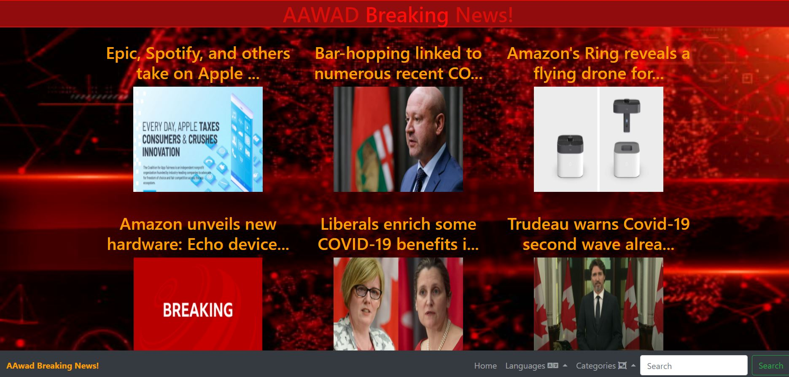
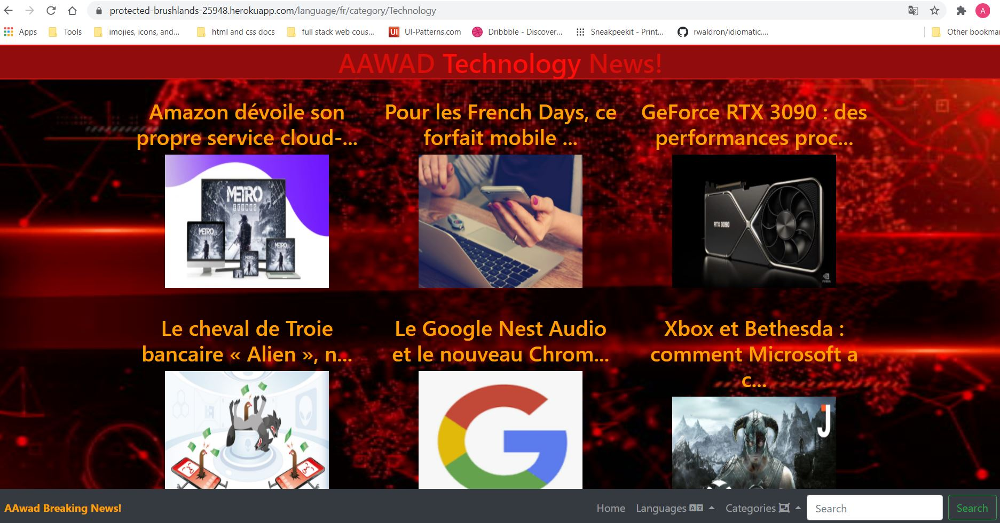

# aawad_news

<h1>Description</h1>

AAWAD News is a news scrapping web app that gets and displays daily news using <a href="https://newsapi.org/">NewsAPI</a>. Here is a live link of the app: https://protected-brushlands-25948.herokuapp.com/

The home page views assorted news from various categories. Please understand that the default language of the home page in English and the default country is Canada.

You can see from the screenshot above that each news block shows only the first 40 characters, which is done like that to keep a consistent design. Some of the news received from NewsAPI does not have images stored. Furthermore, to go around this issue, I uploaded a filler image that shows the "BREAKING" text, and I set up the app to display this image when there is no image available from the API. Please understand that sometimes the news article itself may provide a broken image URL. In this case, the first word of the article titles appears as an alternative text of the broken image.

By using the navigation bar, users can filter the news by category or language. 
This app only filters into four categories:
<ul>
  <li>Politics</li>
  <li>Health</li>
  <li>Business</li>
  <li>Technology</li>
 </ul>

 
Also, this app allows users to filter the news to appears in one of three languages. Please notice each country has a limited set of languages. It's not possible to get Arabic news articles of News content published by Canadian sources.

   
   
The screenshot below shows a page filtered to show news with technology as the selected category and french as the selected language.

   
   
Notice the change of the website's header message. On the home page, the header message is "AAWAD Breaking News!" while in the image above, the text says "AAWAD Technology News!" instead, which reflects the selected category.

   
The final feature in the navigation bar is the search input. Users can search using any language, even the languages which are not available in this app, as long as they are supported by the NewsAPI.

<h1>Code Structure</h1>
<h2>EJS</h2>

TThis project uses EJS files to view the frontend content. EJS file allowed me to insert javascript code into the HTML content, and at the same time, it allowed me to access variables data. Also, it allowed me to integrate EJS files within other EJS files, which made the code much simpler.
The EJS syntax that has been used in this code is shown below.

<table>
  <tr>
    <th>EJS</th>
    <th>Function</th>
  </tr>
  <tr>
    <td><%statements%></td>
    <td>Integrating javascript in HTML document</td>
  </tr>
  <tr>
    <td><%=variable%></td>
    <td>Reading variable value rendered by Node.js</td>
  </tr>
  <tr>
    <td><%-include(<ejs>)-%></td>
    <td>Integrating/including an ejs file including another</td>
  </tr>
  </table>
  
Using EJS and forEach statement, the app renders as much news as the NewsAPI is providing for specific categories, language, or search.

  
Another thing to notice in the code is that there are five views, as listed below:
  <ul>
    <li>Header</li>
    <li>Footer</li>
    <li>Home</li>
    <li>Filtered</li>
    <li>Search</li>
  </ul>
  Both Header and Footer views get integrated into the rest of the views using EJS. 
  The header is where Bootstrap's CDN and Navbar are in the code. There are seven links in total in the navbar, and each category or language selected has one URL. Furthermore, these links help in determining the category and the language selected by the user. The links associated with categories and language use <em>params</em> is the link. 
  If a category is selected, the link will include that category and any of the three languages based on previous language previous selected. 
  The opposite happens when a language is selected instead of a category. 
  The search form initiates a POST request with the route "/" when submitted.

  
The footer states the copyright with my name and the current year. Notice that the current year updates dynamically based on the year value rendered by the app.

  
The Home view, as explained previously, renders as much news block as available of the selected category and language or search.

  
The Fitered view is similar to Home views, but the filtered view filters the news based on the URL params of the language and category. Previously, I had the filtered and the home view merged, where I had only one view, but I learned that this does not work out because the home page would render whatever filters the previous user applied to whoever users choose to visit the app after him or her.

  
Search view renders news article blocks with the category and filters cleared out in the frontend of EJS, and the backend of EJS, so people can search using any language and get results in the language. 
  <h2>Node.js</h2>
   
In Node.js, I required Express and body-parser packages and set up the express app to listen to a port. The app accepts GET and POST requests.  GET requests render the EJS views. Search view renders in response to POST request. 
   Below is a table that shows the NewsAPI options for each view.
   <table>
    <tr>
      <th>View</th>
      <th>Path</th>
      <th>Cateogry</th>
      <th>Language</th>
      <th>q "search term"</th>
  </tr>
  <tr>
    <td>Home</td>
    <td>/</td>
    <td>General</td>
    <td>en</td>
    <td>No Value</td>
  </tr>
  <tr>
    <td>Filtered</td>
    <td>/language/:selectedLanguage/category/:selectedCategory</td>
    <td>selectedCategory</td>
    <td>selectedLanguage</td>
    <td>No Value</td>
  </tr>
  <tr>
    <td>Search</td>
    <td>/</td>
    <td>No Value</td>
    <td>No Value</td>
    <th>Value submitted by POST request on path "/"</th>
  </tr>
  </table>
  

  

  In addition to the categories mentioned in the table above, the country category gets its value according to the selected language. Here is a table of how the language category mapped to the country category.
  <table>
  <tr>
  <th>Language</th>
  <th>Country</th>
  </tr>
  <tr>
    <td>en "English"</td>
    <td>ca "Canada"</td>
  </tr>
  <tr>
    <td>ar "Arabic"</td>
    <td>ae "United Arab Emirates"</td>
  </tr>
  <tr>
    <td>fr "French"</td>
    <td>fr "France"</td>
  </tr>
  </table>
  

  
Notice that when the app handles a POST request, it clears out the category and search parameters, and it sets the q parameter with the search term submitted. 
  Before the category and language parameters get cleared out, a function called setPrevious gets called to save the parameter value. If a user decided to get back to the filtered view after going to the search view, the user would either need the previous category or language value. If they are not set, NewsAPI won't respond with the expected filters. Furthermore, after the search posh request is done, and the Search view is rendered, the previous values set by the function or method setPrevious get assigned back the category and the language parameters.

  
Another issue that I had to fix is that NewsAPI sometimes set duplicated news articles with the same title and image, so normally they get displayed twice in the app. 
  In order to stop this from happening, before rendering the articles, a function called filterDuplicates gets called, and in this function, there is a nested loop that compares each article with the values stored in an array called validatedArticles. 
  Moreover, validatedArticles array store the article's title if the title was not already stored in the array. I defined a counter the counts from zero to one if there is an article with the same title already stored as validated. The title gets stored only if the counter remains at zero.

  
In conclusion, an app like this one gets limited by the used API capabilities. The one thing that I would like to have improved is to stop the connection between the language and the country categories to give a smoother experience to the app users. On the other hand, some issues are controllable by web developers, such as the duplication issue that I faced.

  
Thank you for taking the time to read this documentation.

